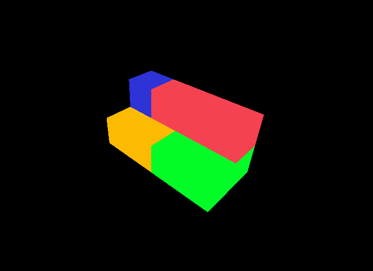

# Raport
## Cel
Stworzenie interfejsu użytkownika dla systemu planującego załadunek ciężarówek - wyświetlanie ładunku w 3D.

## Backend
Backend nie sprawił problemów, ponieważ mam duże doświadczenie w tworzeniu REST API.
Opiera się na ASP<span></span>.NET Core 3.0.

Przykładowy JSON:
```
[
    {
        "width": 2,
        "length": 2,
        "depth": 2,
        "x": 0,
        "y": 0,
        "z": 0,
        "color": "0xfcba03"
    },
    {
        "width": 1,
        "length": 2,
        "depth": 1,
        "x": -0.5,
        "y": 1,
        "z": -0.5,
        "color": "0x2d33d6"
    },
    {
        "width": 3,
        "length": 1,
        "depth": 1,
        "x": 1.5,
        "y": 1,
        "z": -0.5,
        "color": "0xf54251"
    },
    {
        "width": 2,
        "length": 4,
        "depth": 2,
        "x": 2,
        "y": 0,
        "z": 0,
        "color": "0x03fc28"
    }
]
```

## Frontend
Tworzenie frontendu zajęło znacznie więcej czasu. Początkiem było wybranie odpowiedniej technologii - ze względu na doświadczenie w OpenGL i WebGL wybralem three.js, który opiera się na WebGL.

Wcześniej używalem Angular do tworzenia interfejsu użytkownika, więc znów wybrałem ten framework. Niestety okazało się że three.js nie współpracuje dobrze z tą technologią. Próbowałem naprawić problem na kilka sposóbow, ale zawsze pojawiały się błędy. Z tego co czytałem w internecie, jest to świeży problem i możliwe, że niedługo zostanie naprawiony.

W międzyczasie wykorzystałem React.js (po raz pierwszy) do zbudowania dema, które wygląda tak (obiekty wygenrowane na podstawie JSON z poprzedniej części):



Jeżeli problemy z Angular nie zostaną rozwiązane w Lutym, React.js zostanie jako technologia frontend dla naszego projektu.
